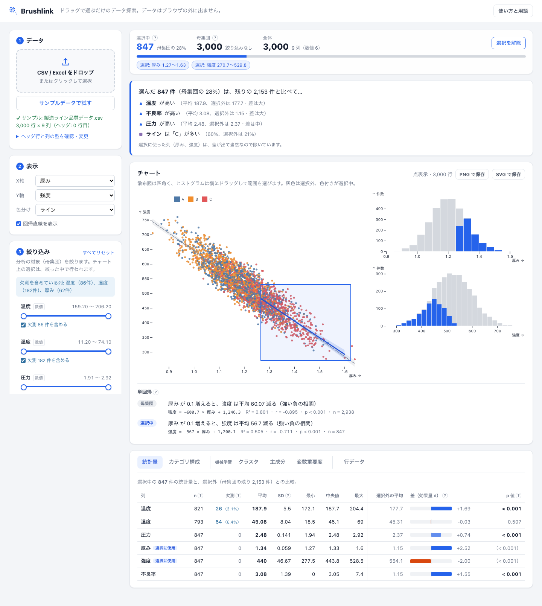

# Brushlink

実験データをドラッグ選択するだけで、条件ごとの違いをその場で比較できる探索的データ分析ツール。
ブラウザだけで動き、データはどこにも送信されない。

**公開URL: https://soma2028.github.io/brushlink/** （「サンプルデータで試す」ですぐ触れる）



*(名前は可視化分野の用語 brushing and linking から。TIBCO Spotfire に着想を得ているが、製品名としての言及ではなく出典として記す)*

## 解決する課題

研究室の実験は、条件を変えながら同じ計測を何十回も繰り返す。培養条件ごとの温度・収率、
分析条件ごとの吸光度・ノイズ――出てくる CSV / Excel は増える一方で、「条件Aと条件Bで
何が違うか」を見るたびに、Excel でピボットテーブルを組み直したり、条件列でシートを
フィルタしてはグラフを取り直したりする作業が発生する。データ自体はシンプルでも、
比較のたびに手作業が挟まるので、確認のサイクルが遅くなる。

このツールが直接手当てするのはそこで、散布図の上をドラッグして範囲を選ぶだけで、
その範囲に対応する行がヒストグラム・統計量・回帰・データ表に即座に反映され、
「選んだ行は残りの行と何が違うか」が文章・検定・機械学習で返ってくる。
ヘッダ行がずれた実験機器の出力や、欠測を含むデータもそのまま投げ込めるようにしてあるのは、
研究室のデータが「素直な整形済み CSV」ではないことが多いという前提に立っているため。

## できること

| 機能 | 内容 |
|---|---|
| 読み込み | CSV / Excel をドロップ。ヘッダ行を自動推定し、外れたらプレビューのクリックで選び直す |
| 自動の初期表示 | 相関が最も強い2列を散布図の軸に、最初のカテゴリ列を色分けに自動で設定 |
| クロスフィルタ | 散布図・ヒストグラムのドラッグで選択。母集団（灰）と選択中（色）を重ねて表示 |
| 絞り込み | 数値はレンジ、カテゴリはチェックボックス。欠測を含めるかを列ごとに切替。絞り込みの「中で」選択する2段構え |
| 文章要約 | 選んだ行が残りと比べて何が違うかを、効果量と検定で上位だけ日本語で要約 |
| 統計量・群間比較 | 列ごとの n・欠測・平均・SD・中央値など。選択中 vs 選択外の効果量 d と Welch の t 検定、カテゴリ構成の χ² 検定 |
| 単回帰 | 母集団・選択中それぞれの回帰直線（95% 信頼区間）と式・R²・p 値 |
| 機械学習 | k-means（クラスタ数は自動）、PCA、ランダムフォレストの変数重要度。クラスタと主成分得点は列として追加でき、色分け・軸に使える |
| 図の書き出し | 画面のチャートを、条件（軸・件数・選択範囲・絞り込み）の注記付きで PNG / SVG に |

## 使い方

公開URLを開くだけ。手元で動かす場合:

```bash
cd web
npm install
npm run dev      # http://localhost:5173/brushlink/
npm run test:e2e # ブラウザ駆動テスト（Chromium）。test:e2e:all で WebKit・Firefox も
```

## 技術構成

| 層 | 実装 | 役割 |
|---|---|---|
| データ | DuckDB-WASM | ブラウザ内で動くインメモリ列指向エンジン。読み込んだ表を SQL で集計する |
| 可視化・連動 | Mosaic (`@uwdata/vgplot`) | チャート間の選択連動（`Selection.crossfilter`）と SQL 集計の橋渡し |
| ファイル解析 | SheetJS (`xlsx`) | CSV / Excel を同じ経路で2次元配列にする |
| 統計 | jStat | t 分布・χ² 分布の累積分布関数（p 値）。平均・分散・回帰係数の集計自体は DuckDB 側 |
| 機械学習 | 自前実装（Web Worker） | k-means・PCA・ランダムフォレスト。別スレッドで計算し、操作を止めない |
| 言語・ビルド | TypeScript / Vite | strict の型検査。GitHub Pages に静的配信 |
| テスト | Playwright | 本番ビルドを Chromium / WebKit / Firefox で操作する e2e テスト |

```
web/src/
  main.ts          画面の組み立てと各モジュールの配線
  upload.ts        CSV/Excel の読み込みと DuckDB への登録
  sample.ts        「サンプルデータで試す」用の合成データ生成
  filters.ts       絞り込みパネル（$filter）
  charts.ts        散布図・ヒストグラム・回帰直線（dot/raster 自動切替）
  settle.ts        ドラッグが止まってから追従する Selection（集計系の負荷対策）
  stats.ts         件数・要約統計量・選択中 vs 選択外の比較
  categories.ts    カテゴリ構成の比較（χ² 検定）
  regression.ts    単回帰の集計と文章化
  inference.ts     検定（Welch の t 検定、χ² 検定、選択外の分散の逆算）
  insights.ts      選択範囲の特徴の文章要約
  rows.ts          選択中の行のデータ表
  ml.ts            k-means・PCA・ランダムフォレスト（純粋な計算）
  ml.worker.ts     上を別スレッドで動かす Web Worker
  mlPanel.ts       機械学習タブの画面と、結果の列としての書き戻し
  export.ts        図の書き出し（SVG の合成と PNG 変換）
web/e2e/           ブラウザ駆動テスト（ドラッグ選択・絞り込み・機械学習・書き出しなど20件）
docs/performance.md  データ量とパフォーマンスの計測結果
```

## 設計判断とその理由

**サーバーを持たず、ブラウザ内で完結させた**
最初の版（`v0.1-python` タグ）は Python + Panel で作ったが、使うたびに Python 環境と
サーバープロセスが必要だった。DuckDB-WASM でブラウザ内に閉じれば静的ファイルを
配るだけで動き、研究データを外部サーバーに一切送らずに済む。公開URLをそのまま
ポートフォリオとして渡せるのもこの構成の利点。

**比較の相手は「母集団全体」ではなく「選択外（残りの行）」にした**
範囲を選ぶ行為そのものが「この行たちは他と何が違うのか」という問いなので、
選択中と、母集団のうち選んでいない行の2群で比べる。母集団全体と比べると選択中が
両方の群に含まれ、検定として成り立たない。選択外は別クエリを組まず、母集団と選択中の
集計値から分散の合成公式を逆向きに使って求めている（`NOT` 条件を組むと欠測行が
消える問題を再び抱えるため）。

**選択に使った列は、要約・変数重要度から外した**
散布図で「厚み」の範囲を選べば、厚みに差が出るのは当然で、p 値は必ず小さくなる。
それが要約の上位を占めると、本当に知りたい「他に何が違うか」が埋もれる。
表には「選択に使用」の印を付けて残し、p 値は括弧書きにして意味がないことを示している。

**p 値だけでなく効果量を主役にした**
件数が数千になると、実質的に意味のない差でも p 値は 0 に張り付く。文章要約は
「有意かつ効果量が小以上」の列だけを拾い、表でも効果量 d をバーで示す。

**機械学習の結果は、新しいチャートではなく「列」として返す**
クラスタのラベルや主成分得点を DuckDB のテーブルに列として書き戻し、色分け・軸の
選択肢に加える。専用の図を増やすと、その図だけがクロスフィルタから切り離される。
列にすれば、クラスタや主成分の上でもそのままドラッグ選択が効く。

**チャートは即時、集計はドラッグが止まってから**
DuckDB-WASM はクエリを1本のキューで順に処理する。ドラッグの1フレームごとに
統計量・カテゴリ構成・回帰・データ表まで集計し直すと待ち行列が詰まり、
5万行ではドラッグを離してから約3.5秒遅れて反映された。チャートと選択件数は即時に、
重い集計は 180ms 操作が止まってから走らせるように分けた（離してから 0.4〜0.8秒で反映）。

**統計量には Mosaic の事前集計を使わせない**
Mosaic はクロスフィルタを速くするため、ブラシの範囲を画面のピクセル単位に丸めた
事前集計テーブルを使う。描画には十分だが、件数や平均が厳密な値から1件単位でずれる
（選択件数 847 に対し回帰の n が 848 になった）。統計量として出すクライアントは
`filterStable: false` で事前集計を無効にしている。

**散布図は 15,000 行を境に、点表示と密度表示を自動で切り替える**
点表示は1点ごとに SVG 要素を作るので、ドラッグ中に止まる1フレームが行数にほぼ比例して
伸びる（1万行 51ms → 2万行 約100ms → 5万行 278ms）。密度表示（raster）は
1万〜10万行で目立った停止が出なかった。入力への応答が 100ms を超えると遅れとして
体感されるので、それを明確に下回る 15,000 行を境にした（`docs/performance.md`）。
当初は計測の空白域に置いた暫定値 50,000 だったが、実測して引き下げた。
切り替えをユーザーに選ばせる UI は作らず、行数から自動で決める。

**ウィンドウの大きさが変わっても、チャートを作り直さない**
作り直すとブラシ（選択範囲）が消える。Plot の幅だけを変えて手元のデータで描き直すと、
ブラシはデータ値として保持されているので、新しい目盛りの上に同じ範囲が描き直される。

**カテゴリの色は、絞り込み前の全カテゴリで固定する**
色分けの色は既定では表示中のカテゴリから割り当てられるため、絞り込みで「ライン A」を
外すと「ライン C」の色が赤から橙に変わっていた。列の全カテゴリを色の定義域として
固定し、カテゴリ構成タブの帯グラフも同じ割り当てにした。

**カテゴリ列の上限を 20 種にした**
色分け・チェックボックスとして成立するカテゴリ列の上限を、代表的なカテゴリパレット
（Category20）の色数に合わせた。これを超える列（ID 列など）は色が循環して区別できず、
チェックボックスも一覧性を失う。

**統計ライブラリは jStat にした**
p 値に必要なのは t 分布・χ² 分布の累積分布関数だけで、平均・分散・回帰係数は
DuckDB の集計関数で求まる。simple-statistics は t 検定の統計量は出せるが分布関数を
持たず p 値を出せないため、分布関数を網羅している jStat を選んだ。
機械学習はライブラリを使わず実装した（3手法で依存が3つ増えるうえ、変数重要度を出せる
軽量な JS 実装が見当たらず、乱数シードを固定して結果を再現可能にしたかったため）。

## 実装中に見つけた不具合

**欠測を含む行が、フィルタ未操作の初期状態で消えていた**（Python版で発見、Web版にも同じ対処）
SQL の `BETWEEN` / `IN` は NULL に対して偽扱いになるため、フィルタを一切操作して
いなくても欠測行が母集団から消えていた。各条件に `OR 列 IS NULL` を足し、
「欠測を含める」チェックボックスで列ごとに切り替えられるようにした。

**レンジスライダーを動かしていないのに、最大値の行が母集団から落ちていた**
`<input type="range">` に小数の min/max/step を渡すと、ブラウザが値を step の整数倍に
丸める際の浮動小数点誤差で右端が1段手前になっていた。スライダーを 0〜200 の整数位置で
持ち、両端は必ず真の最小値・最大値に写すようにした。

**同じ列構成の別ファイルを読み込むと、古いデータの集計が使われうる**
Mosaic の事前集計テーブルは、作成クエリの文字列のハッシュで名前が決まり、
`CREATE TABLE IF NOT EXISTS` で作られる。テーブルを読み替えてもクエリ文字列が
同じなら古いテーブルが再利用される。読み込みと列の書き戻しのたびに、事前集計の
スキーマを破棄するようにした。

**軸を変えると、見えない選択が統計量に効き続けていた**
チャートを作り直すと古いブラシの枠は消えるが、選択条件は Selection に残っていた。
作り直す前に、チャートで選んだ条件だけを解除するようにした。

## 今後

- [ ] Safari / Firefox での性能計測（動作はテストで確認済み。点表示/密度表示の閾値
  15,000 は Chromium での計測に基づく）
- [ ] 散布図そのものをドラッグしたときの、自チャート内での選択の強調
  （現在は crossfilter の仕様上、選択した散布図自身の点は色が変わらず、枠で示している）
